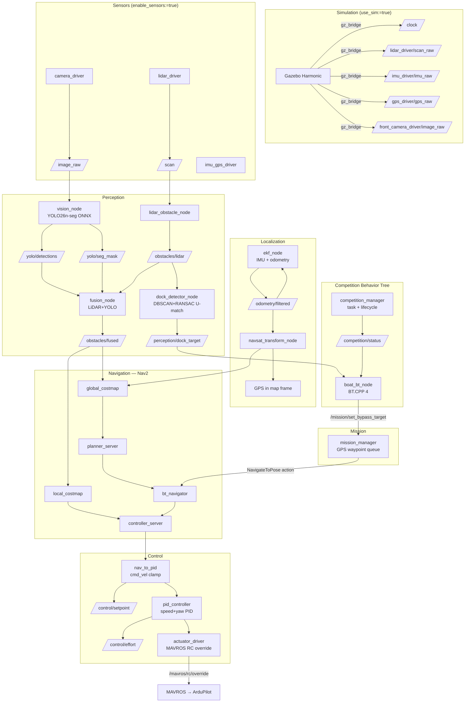

# Njord 2026

ROS 2 Jazzy autonomous surface vessel (ASV) stack for the [NODE Engineering Club](https://github.com/NODE-Engineering-Club) competition robot **Asket**.

## Getting Started

**Prerequisites (one-time install):**
1. [VSCode](https://code.visualstudio.com/)
2. [Docker Desktop](https://www.docker.com/products/docker-desktop/) — Windows / macOS. On Linux, Docker Engine or Podman works.
   - Linux/Podman: set `"dev.containers.dockerPath": "podman"` in VSCode user settings.
3. VSCode extension: [Dev Containers](https://marketplace.visualstudio.com/items?itemName=ms-vscode-remote.remote-containers)

**To start developing:**
1. Open this folder in VSCode
2. Click **Reopen in Container** when prompted (or `Ctrl+Shift+P` → *Dev Containers: Reopen in Container*)
3. First launch takes ~5 minutes to build. After that it's instant.

The `postCreateCommand` runs `colcon build --symlink-install` automatically and sources the workspace.

**Run the full stack (hardware):**
```bash
ros2 launch bringup njord.launch.py
```

**Run in simulation (Gazebo Harmonic):**
```bash
ros2 launch bringup njord.launch.py \
  use_sim:=true \
  enable_sensors:=false \
  enable_mavros:=false
```

This launches Gazebo with `basicWorld.sdf`, spawns the Asket URDF, bridges the sim clock, and runs the full navigation/control/mission stack against simulated sensor topics.

**Rebuild after adding new files** (`--symlink-install` means code edits don't need a rebuild for Python packages):
```bash
# The mission GUI's frontend must be built BEFORE this, or colcon installs an
# empty static directory and the GUI serves a 503. See src/gui_backend/README.md.
cd src/asket_gui && npm install && npm run build && cd ../..

colcon build --symlink-install
source install/setup.bash
```

## Launch Arguments

| Argument | Default | Description |
|---|---|---|
| `use_sim` | `false` | Enable Gazebo, sim clock, gz_bridge |
| `enable_mavros` | `true` | MAVROS FCU bridge (ArduPilot) |
| `enable_localization` | `true` | EKF + NavSat transform |
| `enable_nav2` | `true` | Full Nav2 stack |
| `enable_sensors` | `true` | Camera, LiDAR, IMU/GPS drivers |
| `enable_perception` | `true` | LiDAR obstacle node + fusion |
| `enable_control` | `true` | nav_to_pid, PID, actuator driver |
| `enable_mission` | `true` | GPS waypoint sequencer |
| `enable_vision` | `true` | YOLO inference node |
| `enable_foxglove` | `true` | Foxglove WebSocket bridge (port 8765) |
| `vision_confidence` | `0.5` | YOLO detection confidence threshold |
| `camera_device` | `/dev/video0` | Camera device path |
| `lidar_device` | `/dev/ttyUSB0` | LiDAR serial device path |
| `camera_info_url` | `package://bringup/config/front_camera.yaml` | `camera_info_manager` URL for camera intrinsics YAML |
| `lidar_camera_extrinsic` | `""` | Path to `lidar_camera_extrinsic.yaml`; empty = use URDF nominal `lidar→front_camera` TF |
| `world` | `basicWorld.sdf` | World file name under `description/worlds/` to load in Gazebo (e.g. `dockingWorld.sdf` for the U-shaped Task 3.1 berth) |
| `enable_competition` | `true` | Competition Manager (task selection + lifecycle) |
| `enable_boat_bt` | `true` | Competition Behavior Tree (`boat_bt_node`) |
| `headless` | `true` | Run Gazebo server-only (`gz sim -s`). **In practice `-s` deadlocks sensor rendering even under software rendering (Xvfb, `LIBGL_ALWAYS_SOFTWARE`, `--headless-rendering` — all tried, all hung identically) — set `false` to actually get sensor data in a no-GPU environment.** Real-time factor is still low without a GPU (~0.08 measured in one sandbox); see `TODOS.md`. |

## Workspace Layout

```
src/
├── description/    # URDF (asket.urdf.xacro), meshes, Gazebo worlds (basicWorld.sdf, dockingWorld.sdf)
├── sensors/        # camera_driver, lidar_driver, imu_gps_driver
├── perception/     # lidar_obstacle_node, fusion_node, dock_detector_node
├── control/        # nav_to_pid, pid_controller, actuator_driver
├── mission/        # mission_manager (GPS waypoint sequencer)
├── vision/         # vision_node (YOLO26n-seg ONNX inference)
├── calibration/    # scan_to_cloud, collect_data, calibrate, extrinsic_tf_publisher
├── boat_bt/        # boat_bt_node — competition Behavior Tree (BT.CPP 4)
├── competition_manager/  # competition_manager — task selection + lifecycle state machine
├── njord_msgs/     # Shared interfaces (DockTarget, CompetitionState, SetBypassTarget, ...)
└── bringup/        # njord.launch.py + config/
    └── config/
        ├── ekf.yaml                      # robot_localization EKF params
        ├── navsat.yaml                   # NavSat transform params
        ├── nav2_params.yaml              # Nav2 planner/controller/costmap params
        ├── gz_bridge.yaml                # Gazebo ↔ ROS topic bridges
        ├── front_camera.yaml             # camera intrinsics (generate with calibrate_camera.launch.py)
        └── lidar_camera_extrinsic.yaml   # LiDAR→camera extrinsic (generate with calibrate_lidar_camera.launch.py)
models/             # ONNX weights (bind-mounted, gitignored)
```

## Architecture



`competition_manager` also calls `mission_manager`'s `/mission/start` directly for waypoint-based tasks (not shown — see Competition Behavior Tree section below for the full task-routing picture); `boat_bt_node` additionally subscribes to a global obstacle-tracking topic (from the `fusion` package, not pictured here) for `GlobalSafety`'s collision-risk detection.

## TF Frame Tree

The full coordinate frame tree, verified with `ros2 run tf2_tools view_frames`:

```
map
 └── odom                    (robot_localization EKF — dynamic)
      └── base_link           (robot_localization EKF — dynamic)
           ├── lidar_mount    (robot_state_publisher — static)
           │    └── lidar     ← lidar_driver frame_id
           ├── front_camera   ← camera_driver frame_id
           ├── back_camera
           ├── GPS
           └── px4            ← IMU / FCU mount
```

Static sensor transforms (published to `/tf_static` by `robot_state_publisher` from the URDF):

| Parent | Child | xyz (m) | rpy (rad) |
|---|---|---|---|
| `base_link` | `lidar_mount` | -0.103585, 0, 0.137275 | 0, 0, -π/2 |
| `lidar_mount` | `lidar` | 0, 0, 0.0375 | 0, 0, 0 |
| `base_link` | `front_camera` | 0, 0.02, 0.137275 | 0, π/2, 0 |
| `base_link` | `back_camera` | -0.62, -0.02, 0.137275 | 0, π/2, 0 |
| `base_link` | `GPS` | -0.18827, 0, 0.174775 | 0, 0, 0 |
| `base_link` | `px4` | 0, 0, 0 | 0, 0, 0 |

`odom → base_link` is published dynamically by the EKF once IMU and GPS data are available. `map → odom` is published by `navsat_transform_node`.

**Simulation-only static publishers** (conditional on `use_sim:=true`):

| Parent | Child | Purpose |
|---|---|---|
| `map` | `odom` | Identity fallback until navsat establishes GPS datum |
| `lidar` | `asket/base_link/Lidar_sensor` | Bridges Gazebo scoped sensor frame to URDF frame for collision_monitor |

## Key Topics

| Topic | Type | Direction | Description |
|---|---|---|---|
| `/lidar_driver/scan_raw` | `sensor_msgs/LaserScan` | in | LiDAR scan (hardware driver or Gazebo bridge) |
| `/lidar_driver/cloud` | `sensor_msgs/PointCloud2` | out | LaserScan reprojected to 3D (z=0, frame `lidar`) — published by `scan_to_cloud` during calibration |
| `/front_camera_driver/image_raw` | `sensor_msgs/Image` | in | Front camera frame (BGR8 640×480) |
| `/front_camera_driver/image_raw/camera_info` | `sensor_msgs/CameraInfo` | out | Camera intrinsics (K, D) loaded from `front_camera.yaml` via `camera_info_manager` |
| `/imu_driver/imu_raw` | `sensor_msgs/Imu` | in | IMU data |
| `/gps_driver/gps_raw` | `sensor_msgs/NavSatFix` | in | GPS fix |
| `/odom` | `nav_msgs/Odometry` | in (sim) | Gazebo ground-truth odometry (OdometryPublisher) |
| `/clock` | `rosgraph_msgs/Clock` | in (sim) | Simulation clock |
| `/yolo/detections` | `vision_msgs/Detection2DArray` | out | YOLO detections |
| `/yolo/seg_mask` | `sensor_msgs/Image` | out | Instance segmentation mask |
| `/obstacles/lidar` | `sensor_msgs/PointCloud2` | out | Raw LiDAR obstacles (frame: `lidar`) |
| `/obstacles/fused` | `sensor_msgs/PointCloud2` | out | LiDAR+YOLO fused obstacles (frame: `base_link`) |
| `/perception/dock_target` | `njord_msgs/DockTarget` | out | Backward-compatible singular topic: highest-confidence FREE berth (`occupied=false`), or `detected=false` if none — `base_link` frame |
| `/perception/dock_targets` | `njord_msgs/DockTargetArray` | out | Every U-shaped berth recognized this scan, occupied and free (Task 3.1), `base_link` frame — see `DockTarget.msg` for fields |
| `/odometry/filtered` | `nav_msgs/Odometry` | out | EKF-fused odometry |
| `/odometry/gps` | `nav_msgs/Odometry` | out | GPS converted to map frame (navsat_transform_node) |
| `/cmd_vel` | `geometry_msgs/Twist` | out | Final arbitrated velocity command consumed by `nav_to_pid` (hardware) and `ros_gz_bridge`/`VelocityControl` (sim). Published by `twist_mux`, not Nav2 or boat_bt directly — see below. |
| `/nav2/cmd_vel` | `geometry_msgs/Twist` | out | Nav2's own output (`cmd_vel_nav` → `velocity_smoother` → `cmd_vel_smoothed` → `collision_monitor` → here). twist_mux input, priority 10. |
| `/boat_bt/cmd_vel` | `geometry_msgs/Twist` | out | `boat_bt_node`'s direct docking commands. twist_mux input, priority 100. |
| `/control/setpoint` | `geometry_msgs/Twist` | out | Clamped speed/yaw setpoint |
| `/control/effort` | `geometry_msgs/Twist` | out | PID output |
| `/mavros/rc/override` | `mavros_msgs/OverrideRCIn` | out | RC channels to ArduPilot |
| `/competition/status` | `njord_msgs/CompetitionState` | out | Current competition task + lifecycle state, published by `competition_manager` (transient-local) |
| `/competition/set_task` | `njord_msgs/SetCompetitionTask` (service) | in | Select the active competition task by `CompetitionState.TASK_*` value |
| `/competition/start` | `std_srvs/Trigger` (service) | in | Start the selected task (skips `mission_manager` and runs the BT directly for waypoint-less tasks) |
| `/competition/complete` | `std_srvs/Trigger` (service) | in | Called by `boat_bt_node` to report a direct-BT task (e.g. docking) finished |
| `/mission/set_bypass_target` | `njord_msgs/SetBypassTarget` (service) | in | Requested by `boat_bt_node` to route around a cardinal marker or collision risk |

## Node Reference

### `description`
- **`asket.urdf.xacro`** — Full robot URDF with root link `base_link` (hull body), propellers, LiDAR, cameras, GPS, IMU, and PX4 mount. Includes Gazebo sensor plugins (camera, GPU LiDAR, NavSat, IMU). `robot_state_publisher` reads this file and broadcasts the complete static TF tree on startup.
- **`worlds/basicWorld.sdf`** — Minimal Gazebo Harmonic world with Physics, UserCommands, SceneBroadcaster, Sensors (camera+lidar), IMU, and NavSat system plugins.
- **`worlds/dockingWorld.sdf`** — Same base plugins plus a static `dock_task_3_1` model: a U-shaped berth (two parallel arms + a back wall, ~2.1 m opening) for testing `dock_detector_node`. Load it with `world:=dockingWorld.sdf`.
- **`worlds/dockingWorldOccupied.sdf`** — Two adjoining 2m×2m berths sharing a middle wall, plus a static `decoy_boat` model (reusing Asket's own hull mesh, plugin-free) parked in one berth — for testing occupied-berth handling. Load it with `world:=dockingWorldOccupied.sdf`.

### `sensors`
- **`camera_driver`** — OpenCV camera capture → `/front_camera_driver/image_raw` + `/front_camera_driver/image_raw/camera_info`. Starts in degraded mode if no camera connected. Loads camera intrinsics via `camera_info_manager` from the URL given by the `camera_info_url` parameter (default `package://bringup/config/front_camera.yaml`). Accepts `device` (default `/dev/video0`) and `frame_id` (default `front_camera`) parameters.
- **`lidar_driver`** — RPLidar serial → `/lidar_driver/scan_raw` (`sensor_msgs/LaserScan`, `frame_id: lidar`, 360 rays, 0.2–12 m). Reconnects automatically on disconnect.
- **`imu_gps_driver`** — Relays MAVROS IMU (`/mavros/imu/data` → `/imu_driver/imu_raw`) and GPS (`/mavros/global_position/raw/fix` → `/gps_driver/gps_raw`) to the unified driver topic names. Hardware only (disabled in sim).

### `perception`
- **`lidar_obstacle_node`** — Converts `/scan` → `/obstacles/lidar` (PointCloud2). Filters returns beyond 10 m.
- **`fusion_node`** — Fuses LiDAR point cloud with YOLO segmentation mask via TF projection. Looks up `lidar → camera_frame` in TF to project LiDAR points into the image plane; points confirmed by the segmentation mask are labeled as obstacles. Unmatched YOLO detections get a bearing estimate at 5 m. Publishes `/obstacles/fused` in `base_link` frame. Camera intrinsics update live from `/front_camera_driver/image_raw/camera_info`. Parameters: `lidar_frame` (default `lidar`), `camera_frame` (default `front_camera`, switches to `front_camera_cal` when `lidar_camera_extrinsic` launch arg is set), `camera_info_topic`.
- **`dock_detector_node`** — Recognizes U-shaped docking berths (Task 3.1, "normal docking") from `/obstacles/lidar`, including multiple adjoining berths sharing a wall: DBSCAN separates the cloud into candidate objects, iterative RANSAC extracts straight wall segments from each, and the segments are matched against a U template (two parallel arms + a perpendicular back wall, opening toward the boat) — every valid match within a cluster is kept, not just the best, so a wall shared between two berths can yield a separate detection per berth. Each match is classified occupied/free by checking whether scan points fall inside its interior beyond what its own matched walls explain. Publishes every recognized berth on `/perception/dock_targets` (`njord_msgs/DockTargetArray`), plus a backward-compatible `/perception/dock_target` (`njord_msgs/DockTarget`): the highest-confidence FREE berth, or `detected=false` if none. Key parameters: `berth_width_m` (default 2.0), `width_tolerance_m`, `arm_length_min_m`/`arm_length_max_m`, `parallel_angle_tol_deg`, `perp_angle_tol_deg`, `lidar_yaw_offset_deg` (mount-yaw correction into `base_link`, default 90°), `occupancy_margin_m`/`occupancy_min_points` (occupancy classification). Perception-only — no temporal filtering across scans yet. Consumed by `boat_bt_node`'s docking controller via the singular `/perception/dock_target` topic (see `boat_bt` below); the richer `/perception/dock_targets` array is published but not yet consumed by anything.

### `boat_bt`
- **`boat_bt_node`** — Competition Behavior Tree (BT.CPP 4, tree defined in `bt_xml/simple_boat.xml`). Ticks at 10 Hz once odometry (`/odometry/gps`) is received. Structure:
  - **`GlobalSafety`** — runs on every tick regardless of the selected task (except during docking, where close-range dock geometry would otherwise be misread as a collision risk). Selects the highest-risk obstacle from `/obstacles/global` (nearest, most-forward, fastest-closing within `collision_forward_sector_deg`, default ±60°) and requests a bypass via `/mission/set_bypass_target`. Bypass side follows the obstacle's bearing (`+` = port → bypass starboard, `-` = starboard → bypass port; obstacles within a ±2° centreline deadband default to starboard) — a conservative reactive rule, not a full COLREG/CPA classifier.
  - **`CompetitionTaskSelector`** — routes to a per-task subtree based on `/competition/status`. **Maneuvering** and **Path Finding** both currently only handle cardinal-marker bypass (`CardinalMarkerDetected` → `DeterminePassingSide` → `DetermineCardinalBypassTarget` → `RequestCardinalBypass`, following IALA convention: pass a marker on the side it names) — actual waypoint-course navigation for these two tasks is not wired up yet (their `competition_tasks/*.yaml` have no waypoints; see below). **Collision Avoidance**'s task subtree runs the same avoidance sequence as `GlobalSafety`. **Docking** runs `ExecuteDocking` (see below). **Surprise** is an explicit placeholder (`AlwaysSuccess`) pending a task definition.
  - **`MissionMonitor`** — maps `/mission/status` (`MissionStatus.SUCCEEDED/FAILED/ABORTED`) to BT `SUCCESS`/`FAILURE`, `RUNNING` otherwise.

  **Docking controller** (`docking_nodes.cpp`): a state machine — `WAITING_FOR_TARGET → ALIGNING → APPROACHING → FINAL_ENTRY → DOCKED` (hold) `→` reverse `→` complete — driven by `/perception/dock_target`. On reaching the opening it holds station for `docking_hold_duration_sec` (default 10 s), then reverses out at `docking_reverse_speed_mps` (default −0.25 m/s) for `docking_reverse_duration_sec` (default 4 s), then reports completion via `/competition/complete`. If the target is lost mid-approach it stops and waits up to `docking_reacquire_timeout_sec` (default 3 s) before giving up and resetting to `WAITING_FOR_TARGET`; a steering correction is only trusted for `docking_steering_hold_sec` (default 0.3 s) after it arrives, past which the boat holds rather than keep steering on a stale reading. Target confidence must clear `docking_min_confidence` (default 0.45). Publishes to `/boat_bt/cmd_vel`, not `/cmd_vel` directly — see `twist_mux` below. No AR-tag support yet (LiDAR-geometry detection only) and no Task 3.2 parallel-docking variant.

### `twist_mux`
Arbitrates `/boat_bt/cmd_vel` (docking, priority 100) and `/nav2/cmd_vel` (Nav2's own output, priority 10) into the final `/cmd_vel`. Necessary because Nav2's pipeline (`controller_server`, `behavior_server`'s recovery behaviors, `collision_monitor`'s safety-stop heartbeat) keeps publishing even with no active goal — without arbitration it intermittently overrides boat_bt's direct docking commands. Config: `bringup/config/twist_mux.yaml`. `use_stamped: false` — twist_mux 4.5+ defaults to `TwistStamped` for the Nav2/REP-147 migration; this stack is still plain `Twist` throughout.

### `competition_manager`
- **`competition_manager`** — Owns competition task selection and lifecycle (`TASK_NONE/MANEUVERING/PATH_FINDING/COLLISION_AVOIDANCE/DOCKING/SURPRISE` × `STATE_IDLE/READY/RUNNING/SUCCEEDED/FAILED/ABORTED`), published on `/competition/status`. `/competition/set_task` loads and schema-validates the task's YAML definition from `competition_tasks/`; `/competition/start` either calls `mission_manager`'s `/mission/start` with the task's waypoints (rejecting the request if a waypoint-requiring task — Maneuvering or Path Finding — has none configured) or, for waypoint-less tasks like Docking, jumps straight to `STATE_RUNNING` and lets `boat_bt_node` drive directly, reporting back via `/competition/complete`. Task definitions live in `competition_tasks/*.yaml` (schema v1: `task.id`/`name`/`description` + `mission.waypoints`) — **only `docking.yaml` and `collision_avoidance.yaml` are meaningfully complete** (both are waypoint-less, BT-direct tasks); `maneuvering.yaml` and `path_finding.yaml` still have `waypoints: []` and cannot be started.

### `vision`
- **`vision_node`** — YOLO26n-seg ONNX Runtime inference (CPU). Publishes `Detection2DArray` and an instance mask image. Confidence threshold configurable via `vision_confidence` launch arg.

### `control`
- **`nav_to_pid`** — Clamps Nav2 `/cmd_vel` to safe speed (≤2 m/s) and yaw rate (≤1 rad/s), republishes as `/control/setpoint`.
- **`pid_controller`** — Dual PID (speed + yaw) driven by `/control/setpoint` and IMU feedback. Publishes `/control/effort`.
- **`actuator_driver`** — Maps `Twist` effort to MAVROS `OverrideRCIn` RC channels (ch1=steering, ch3=throttle, ±400 µs around 1500 µs centre).

### `mission`
- **`mission_manager`** — Sequences hardcoded `(lat, lon)` waypoints through Nav2's `NavigateToPose` action. Converts GPS → map frame via `robot_localization/FromLL`.

### `calibration`
- **`scan_to_cloud`** — Converts `/lidar_driver/scan_raw` (LaserScan) → `/lidar_driver/cloud` (PointCloud2, frame `lidar`, z=0) using `laser_geometry`. Used during calibration for RViz2 visualisation.
- **`collect_data`** — Interactive two-panel OpenCV GUI: left panel = undistorted camera image, right panel = colour-coded top-down LiDAR map. Click corresponding corners in each panel, press `a` to add pair, `s` to save. Saves pairs to `~/.ros/lidar_camera_data.txt` (`x y z u v` per line).
- **`calibrate`** — Standalone PnP solver (no ROS node). Reads the data file and `front_camera.yaml`, runs `cv2.solvePnPRansac` + LM refinement, prints reprojection error, saves `~/.ros/lidar_camera_extrinsic.yaml`.
- **`extrinsic_tf_publisher`** — Reads `lidar_camera_extrinsic.yaml` and broadcasts `lidar → front_camera_cal` as a static TF. Started automatically by `njord.launch.py` when `lidar_camera_extrinsic` arg is non-empty.

### `bringup`
- **`njord.launch.py`** — Single launch file for the entire stack with per-subsystem enable flags and sim/hardware switching.
- **`ekf.yaml`** — 2D EKF fusing IMU yaw + angular velocity with wheel odometry (if available).
- **`navsat.yaml`** — NavSat transform configured for zero-altitude, Cartesian output, no magnetic declination.
- **`nav2_params.yaml`** — Regulated Pure Pursuit controller, NavFn planner, obstacle costmaps fed by `/obstacles/fused`.

## Simulation Details

Gazebo Harmonic (Sim 8) integration via `ros_gz_bridge` and `ros_gz_sim`:

- World name: `default` (in `basicWorld.sdf`)
- GPS datum: Trondheim (63.4305°N, 10.3951°E) set via `<spherical_coordinates>` in the world SDF — Gazebo NavSat outputs coordinates relative to this origin
- Robot spawned via `ros2 run ros_gz_sim create -file asket.urdf -world default` with a 5 s delay to let Gazebo load
- Clock bridged: `gz.msgs.Clock` → `/clock` (`rosgraph_msgs/Clock`)
- Sensor topics published by Gazebo directly to their driver topic names (e.g. `/lidar_driver/scan_raw`, `/imu_driver/imu_raw`)

**Sensor plugins active in sim:**

| Sensor | Gazebo plugin | Topic |
|---|---|---|
| GPU LiDAR | `gz-sim-sensors-system` | `/lidar_driver/scan_raw` |
| Front camera | `gz-sim-sensors-system` | `/front_camera_driver/image_raw` |
| Back camera | `gz-sim-sensors-system` | `/back_camera_driver/image_raw` |
| IMU | `gz-sim-imu-system` | `/imu_driver/imu_raw` |
| GPS/NavSat | `gz-sim-navsat-system` | `/gps_driver/gps_raw` |

**Gazebo model plugins (in `asket.urdf.xacro`):**

| Plugin | Purpose |
|---|---|
| `gz::sim::systems::OdometryPublisher` | Ground-truth odometry → `/model/asket/odometry` (bridged to `/odom`). Breaks the EKF↔navsat circular dependency by giving EKF a bootstrap odometry source. |
| `gz::sim::systems::VelocityControl` | Applies Nav2 `/cmd_vel` Twist directly to the model body. Appropriate for USV where thruster dynamics are not simulated. |

**Verified working (as of 2026-05-17):**
- Full TF chain `map → odom → base_link` established at startup
- All Nav2 lifecycle nodes (controller, planner, bt_navigator, collision_monitor, etc.) activate cleanly
- GPS waypoint conversion via `/fromLL` returns correct map-frame coordinates
- `navigate_to_pose` goals accepted and executed; WP1 `Goal succeeded` confirmed
- Robot physically moves in Gazebo via VelocityControl plugin

## Camera Calibration

Camera intrinsics are required for accurate LiDAR-camera projection in `fusion_node`. Calibration must be performed once on the vehicle with the physical camera and a printed checkerboard.

**Prerequisites:** Print a 7×9 interior-corner checkerboard with 20 mm squares ([generate one at calib.io](https://calib.io/pages/camera-calibration-pattern-generator)).

**Run the calibrator** (camera must be connected):

*Dev container:*
```bash
ros2 launch bringup calibrate_camera.launch.py
# Optional overrides:
#   camera_device:=/dev/video1   (if camera is not at /dev/video0)
#   size:=6x8                    (if using a different board)
#   square:=0.025                (if squares are 25 mm)
```

*On the Pi (containerized) — mount the config directory so COMMIT writes the YAML directly to the repo:*
```bash
xhost +local:
sudo podman run --rm --name njord-cal \
  --privileged \
  --network host \
  --ipc host \
  --pid host \
  --device /dev/video0 \
  -e DISPLAY=$DISPLAY \
  -v /tmp/.X11-unix:/tmp/.X11-unix \
  -v $(pwd)/src/bringup/config:/root/.ros/camera_info \
  node-ros-2026:calibration \
  bash -c "ros2 launch bringup calibrate_camera.launch.py"
```

The GUI opens automatically. Move the checkerboard around — vary tilt, distance, and position — until all four progress bars (X/Y/Size/Skew) go green. Click **CALIBRATE** → **SAVE** → **COMMIT**.

**Save the result:**

*Dev container:* copy the file from the default camera_info location:
```bash
cp ~/.ros/camera_info/front_camera.yaml src/bringup/config/front_camera.yaml
```

*On the Pi:* the volume mount above writes `front_camera.yaml` directly to `src/bringup/config/` — no copy needed.

Commit the YAML to git and rebuild the image so it is baked into the next deployment.

Rebuild locally so the YAML is picked up by `package://bringup/...`:
```bash
colcon build --symlink-install --packages-select bringup
source install/setup.bash
```

**Verify:**
```bash
ros2 topic echo /front_camera_driver/image_raw/camera_info --once
# K[0] and K[4] should be non-zero focal lengths from your calibration
```

The calibration file is loaded by `camera_driver` via `camera_info_manager` and the intrinsics are forwarded to `fusion_node` over the `/front_camera_driver/image_raw/camera_info` topic at startup.

**Verified working (as of 2026-07-08):** Full CALIBRATE → SAVE → COMMIT flow completed on hardware via the containerized workflow above; `front_camera.yaml` committed to the repo with real intrinsics from the front camera (fx=700.2, fy=696.5, cx=294.6, cy=226.6).

## Camera–LiDAR Extrinsic Calibration

Extrinsic calibration finds the precise rigid-body transform from the LiDAR frame to the camera frame, correcting the nominal URDF values. Uses the [TurtleZhong point-correspondence method](https://github.com/TurtleZhong/camera_lidar_calibration) adapted for ROS2: manually pick matching corners in the camera image and LiDAR scan, then solve with `cv2.solvePnP`.

**Prerequisites:** Camera intrinsic calibration must be complete (`front_camera.yaml` must exist in `bringup/config/`).

**Physical setup:**
- Use a flat board (≥ 40 cm wide) mounted vertically on a stand.
- `base_link` is the hull. The LiDAR scan plane is ~52.5 mm above the hull; the camera lens is ~24.5 mm above the hull. Position the board so its horizontal midline is at LiDAR scan height (~52.5 mm above hull).

**Step 1 — Collect point pairs** (both sensors must be connected):
```bash
ros2 launch bringup calibrate_lidar_camera.launch.py
```
Two OpenCV windows open — camera image (left) and top-down LiDAR map (right). The
camera panel also overlays a magenta guide showing roughly where the LiDAR scan
plane should cross the image, projected from the nominal (uncalibrated)
`base_link→lidar`/`front_camera` TF — useful for lining up clicks vertically, but
not calibrated itself, so don't trust it horizontally.
- Press **`f`** to freeze frames
- Click the **same physical corner** in both windows
- Press **`a`** to add the pair
- Repeat for ≥ 6 corners across ≥ 3 different board positions/angles — collecting
  more than the minimum (10–15 pairs) gives RANSAC room to filter out noisy clicks
- Press **`s`** to save → `~/.ros/lidar_camera_data.txt`

**Step 2 — Solve:**
```bash
ros2 run calibration calibrate
# Prints reprojection error — aim for < 5 px
```

**Step 3 — Apply:**
```bash
cp ~/.ros/lidar_camera_extrinsic.yaml src/bringup/config/lidar_camera_extrinsic.yaml
# Commit to git, then launch with:
ros2 launch bringup njord.launch.py \
  lidar_camera_extrinsic:=$(pwd)/src/bringup/config/lidar_camera_extrinsic.yaml
```

When `lidar_camera_extrinsic` is set, `njord.launch.py` publishes a `lidar → front_camera_cal` static TF and `fusion_node` automatically uses it instead of the URDF-derived `front_camera` frame. Without the argument the stack behaves exactly as before.

**Verify alignment in RViz2:**
```bash
ros2 run rviz2 rviz2
# Add: Image (/front_camera_driver/image_raw) + PointCloud2 (/lidar_driver/cloud, fixed frame: front_camera_cal)
# LiDAR points should project onto visible surfaces in the image
```

**Verified working (as of 2026-07-14):** Full collect → solve → apply flow completed
on hardware — `lidar_camera_extrinsic.yaml` committed with 2.51 px mean reprojection
error (7/12 RANSAC inliers). Not yet visually re-verified in RViz2 per the step
above; see `TODOS.md`.

**References:**

> [1] L. Zhang, X. Xu, J. He, K. Zhu, M. Luo, and Z. Tan, "Calibration Method of 2D LIDAR and Camera Based on Indoor Structural Features," Hohai University. Available: <https://www.researching.cn/articles/OJbfdef44a334f8d3f>

> [2] Q. Zhang and R. Pless, "Extrinsic calibration of a camera and laser range finder (improves camera calibration)," in *2004 IEEE/RSJ International Conference on Intelligent Robots and Systems (IROS)*, vol. 3, Sept. 2004, pp. 2301–2306.

> [3] X. Zhong, *camera_lidar_calibration: A tool used to calibrate the extrinsic between a 2D laser range finder (LRF) and camera*, GitHub, 2018. Available: <https://github.com/TurtleZhong/camera_lidar_calibration>

## Debugging

Run only the subsystems you care about:

```bash
# Vision only — no hardware required
ros2 launch bringup njord.launch.py \
  enable_mavros:=false \
  enable_localization:=false \
  enable_nav2:=false \
  enable_control:=false \
  enable_mission:=false \
  enable_perception:=false

# Perception pipeline only
ros2 launch bringup njord.launch.py \
  enable_mavros:=false \
  enable_localization:=false \
  enable_nav2:=false \
  enable_control:=false \
  enable_mission:=false
```

Useful commands:

```bash
ros2 topic list                              # see all active topics
ros2 topic hz /lidar_driver/scan_raw         # ~10 Hz from driver or sim
ros2 topic hz /obstacles/lidar               # ~10 Hz from lidar_obstacle_node
ros2 topic hz /obstacles/fused               # ~10 Hz from fusion_node
ros2 topic hz /odometry/filtered             # ~30 Hz from EKF
ros2 topic hz /odom                          # ~30 Hz (sim only, Gazebo OdometryPublisher)
ros2 topic echo /yolo/detections             # stream YOLO detections
ros2 topic echo /gps_driver/gps_raw --once  # verify GPS datum (~63.43°N, ~10.39°E in sim)
ros2 run tf2_tools view_frames               # render full TF tree to PDF
ros2 node list                               # confirm all nodes are running
```

**Sensor processing test commands (sim mode):**

```bash
# Launch sim with perception but no vision (YOLO not needed for basic lidar test)
ros2 launch bringup njord.launch.py use_sim:=true enable_vision:=false

# After ~10 s:
ros2 topic hz /lidar_driver/scan_raw     # expect ~15 Hz (Gazebo GPU lidar)
ros2 topic hz /obstacles/lidar           # expect ~15 Hz (passthrough from lidar_obstacle_node)
ros2 topic hz /obstacles/fused           # expect ~10 Hz (fusion timer, lidar-only mode)
ros2 topic echo /obstacles/lidar --once  # verify width > 0 (points detected)
```

## Docking Detection Testing

`dock_detector_node` has two levels of test coverage — run both after touching its parameters or algorithm.

**1. Synthetic test suite (fast, no Gazebo needed):**

```bash
python3 src/perception/test/test_dock_detector.py
```

Spins up `DockDetectorNode` in-process and feeds it synthetic `/obstacles/lidar` scenes (see `src/perception/test/dock_scene_publisher.py`) built directly from `dockingWorldOccupied.sdf`'s geometry — two berths, one occupied by a decoy, swept across a 3×3×3 matrix of distances (3/5/8 m), angles (±30°/0°), and which berth is occupied (A/B/neither). Exits non-zero if the **hard invariant** ever fails: the occupied berth must never be reported as an available (`detected=true, occupied=false`) target. Prints a PASS/FAIL line per case, plus soft/informational checks on whether the free berth was actually found.

**2. Real-Gazebo verification (required after any change — the synthetic suite alone can't catch sim/sensor-fidelity issues like clustering fragmentation or mesh-loading errors):**

```bash
# Launch the two-berth occupied-dock world with perception only
ros2 launch bringup njord.launch.py use_sim:=true world:=dockingWorldOccupied.sdf \
  enable_mavros:=false enable_localization:=false enable_nav2:=false \
  enable_control:=false enable_mission:=false enable_vision:=false
```

The boat spawns at the world origin facing world +x — by design (see `dockingWorldOccupied.sdf`'s comments) the dock sits at true bearing ~90° (the boat's left) so it falls within the sim `gpu_lidar`'s usable FOV cone. **Keep the boat's yaw at 0** when repositioning for tests — rotating it to "face" the dock breaks that FOV alignment.

Reposition the boat with Gazebo's teleport service instead of driving it (faster, deterministic):

```bash
# name/position/z are required; keep orientation identity (w:1) per the note above
gz service -s /world/default/set_pose --reqtype gz.msgs.Pose --reptype gz.msgs.Boolean --timeout 3000 \
  --req 'name: "asket", position: {x: -1.05, y: 2.0, z: 0.1}, orientation: {x: 0, y: 0, z: 0.0, w: 1.0}'
```

Then inspect detections:

```bash
ros2 topic echo /perception/dock_targets --once   # every berth this scan, occupied and free
ros2 topic echo /perception/dock_target --once    # best FREE berth only, or detected:false if none
```

Known-good reference poses (world x/y, yaw=0) against `dockingWorldOccupied.sdf`'s berth layout — Berth A (free) is at world x≈-1.05, Berth B (occupied by the decoy) is at world x≈+1.05, both at world y≈5:

| Pose (world x, y) | Expected result |
|---|---|
| `-1.05, 2.0` | Berth A resolves, `occupied: false` |
| `1.05, 2.0` | Berth B resolves, `occupied: true`; singular topic shows `detected: false` (no free berth in view) |
| `0.0, 0.0` (default spawn) | `detected: false` on both topics — known viewing-angle limitation, see `TODOS.md` |

## Competition Task Testing

Exercise the competition Behavior Tree via `competition_manager`'s services — only `docking` and `collision_avoidance` are currently startable (`maneuvering`/`path_finding` are rejected: no waypoints configured yet):

```bash
# Select a task (TASK_NONE=0, MANEUVERING=1, PATH_FINDING=2, COLLISION_AVOIDANCE=3, DOCKING=4, SURPRISE=5)
ros2 service call /competition/set_task njord_msgs/srv/SetCompetitionTask "{task: 4}"

# Start it — for docking/collision_avoidance this jumps straight to STATE_RUNNING
# and boat_bt_node drives directly (no mission_manager waypoints involved)
ros2 service call /competition/start std_srvs/srv/Trigger "{}"

# Watch the lifecycle
ros2 topic echo /competition/status
```

For docking specifically, `boat_bt_node` needs a live `/perception/dock_target` — either run against `dockingWorld.sdf`/`dockingWorldOccupied.sdf` in sim (see Docking Detection Testing above), or drive it with synthetic perception input for fast iteration without Gazebo (useful in headless/no-GPU environments where Gazebo's sensor rendering may hang — see `headless` launch arg above): publish a synthetic `sensor_msgs/PointCloud2` on `/obstacles/lidar` using `src/perception/test/dock_scene_publisher.py`'s wall-geometry helpers alongside a real `dock_detector_node`, and a synthetic `nav_msgs/Odometry` on `/odometry/gps` to satisfy `boat_bt_node`'s odom gate.

## Production Deploy

```bash
bash scripts/deploy-pi.sh
```

SSHes into `pi@boat.local`, pulls the latest image from GHCR, sets up systemd services for BlueOS and Njord, and reboots.

---

# Mission GUI (Namibia seabed survey)

Added by the GUI overlay. The club stack above is unchanged; everything here is
additive, and every package below is new.

A real-time mission cockpit served from the Jetson and opened in a browser on a
laptop ashore: vessel state, map, obstacle awareness, sensor health, recording
and mode commands, over a wireless link of variable quality.

It is **not** a sonar analysis tool (no point clouds, meshing or bathymetry —
that is SonarView's job, post-mission), and it is **not part of the safety
chain**. The hardware killswitch and RC channel 8 are sovereign; nothing here
can override, delay or interfere with them. See `docs/safety.md`.

## Running it

Off by default, so nobody working on navigation is made to start a web server:

```bash
ros2 launch bringup njord.launch.py enable_gui:=true
```

Then open **http://<jetson>:8090** from the laptop. The backend binds
`0.0.0.0`; being reachable from another machine is the entire point.

Port 8090 was chosen to stay clear of what this workspace already uses:
`foxglove_bridge` on 8765, and the (currently commented) `rosbridge_websocket`
on 9090 and `web_video_server` on 8080. See `docs/SETUP.md`.

The GUI is a separate process from `pico_bridge` and must stay that way.
`pico_bridge` owns the serial link and runs a 20 Hz heartbeat; if it goes quiet
for 600 ms the Pico drops to MANUAL on its own. Nothing in the GUI may block or
starve it.

It can also be launched on its own, without the rest of the stack:

```bash
ros2 launch gui_backend gui.launch.py
```

## Developing it without ROS

Two lighter ways to run it, both permanent features rather than scaffolding:

| | Needs | Use it for |
|---|---|---|
| `cd src/asket_gui && npm install && npm run dev:mock` | Node only | Developing and reviewing the interface |
| `python3 -m gui_backend.core.app --sim` | Node + Python | The real backend against simulated sources |

`pytest` at the repository root runs the GUI's whole test suite with no ROS
installed — every package splits into a ROS-free `core/` and a thin node.

## Packages added

```
src/
├── asket_interfaces/  msg/srv shared by the packages below
├── asket_sim/         simulated sources — a permanent feature, not scaffolding
├── omniscan_bridge/   Cerulean Ping Protocol -> ROS 2 (Omniscan 3D sonar)
├── mission_recorder/  mission directories, trajectory logs, .svlog export
├── system_test/       passive pre-flight built-in test, GO/NO-GO verdict
├── gui_backend/       FastAPI + WebSocket, subscription & bandwidth negotiation
└── asket_gui/         React + MapLibre frontend, served by gui_backend
```

## What the GUI reads

Logical streams are mapped to topics, types and adapter functions in
`src/gui_backend/config/topics.yaml` — nothing is hard-coded, so pointing a
stream at a different topic is a config change.

| GUI stream | Topic | Type |
|---|---|---|
| Position | `/gps_driver/gps_raw` | `sensor_msgs/NavSatFix` |
| Position in map frame | `/odometry/gps` | `nav_msgs/Odometry` |
| Speed, attitude | `/odometry/filtered` | `nav_msgs/Odometry` |
| IMU | `/imu_driver/imu_raw` | `sensor_msgs/Imu` |
| Lidar raw | `/lidar_driver/scan_raw` | `sensor_msgs/LaserScan` |
| Lidar filtered | `/obstacles/lidar` | `sensor_msgs/PointCloud2` |
| Obstacles fused | `/obstacles/fused` | `sensor_msgs/PointCloud2` |
| Commanded effort | `/control/effort` | `geometry_msgs/Twist` |
| Vessel status | `/pico/status` | `std_msgs/String` |
| Mode request | `/pico/mode_request` | `std_msgs/String` |

The Obstacles panel's raw/filtered toggle is backed by the real pair:
`scan_raw` against `obstacles/lidar`, which filters beyond 10 m.

## The map

The map has a real basemap — coastline, harbour, place names — rather than the
coordinate grid it used to draw. The design assumption that there is no
internet in the field was wrong: Namibia has 4G at the launch point.

Four sources, in order of preference: the Jetson's **tile cache**, the
**internet**, a local **`.mbtiles`** file, and a **coordinate graticule** when
there is nothing else. The offline path still works and is still the answer for
a survey with no coverage.

The basemap is **OpenFreeMap**, not OpenStreetMap's own tile server — theirs
forbids the caching this needs ("Offline use is not permitted on
tile.openstreetmap.org"). OpenFreeMap is the same OSM data, keyless, with no
account and no request limit. **OpenSeaMap** depth contours and navigation
marks are available as a toggle, off by default.

Tiles are fetched only on a `full` link; below that the map lives on its cache
and says so. It never presents a cached basemap as live.

`docs/map_tiles.md` has the reasoning, the promises made to those providers,
and what to do if one of them ever asks us to stop.

## The firmware, and what depends on it

**The Pico runs `firmware/pico-node_v4/`, and the stack refuses to fly against
anything else.** That is not pedantry. Two firmwares had diverged, the flashed
one emitted `[STAT] Mode:3 …` while the Jetson filtered for `STATE…`, every
status line was dropped silently, and the downlink kept working — so the boat
moved and nothing looked broken, for months.

v4 announces itself (`[VER] pico-node 4` at boot, `ver=4` first in every status
line), `pico_bridge` logs it and counts lines it rejects, and the pre-flight
check `pico.firmware_version` **fails** on a mismatch. See
`firmware/README.md` for how v4 was built and what was deliberately dropped.

**The `STATE` line format is transcribed, not captured.** It is taken field by
field from the `.ino`, and `asket_sim` now emits it over a real serial port so
the parser is exercised on every test run. What is still missing is a line read
off a physical Pico: `FORMAT_VERIFIED` stays `False` and the pre-flight says so
every run. Do not read a green Pico panel as proof the format is right.

## One thing that is not settled

**"Cut propulsion" cannot cut propulsion.** `pico_bridge` accepts only `AUTO`
and `MANUAL`. The firmware *does* have `MODE_ESTOP` — disarm, relay open, red
light — but only the transmitter can reach it, which is deliberate: see
`docs/safety.md`. The button currently requests `MANUAL`, which removes
autonomous authority (the Pico drives the thrusters only when armed *and* in
AUTONOMOUS), and it says exactly that on screen rather than claiming to stop
the boat. Whether to add a serial path into ESTOP is open, and is a bench
decision with the boat out of the water.

## Also worth flagging

`scripts/deploy-pi.sh` targets `pi@boat.local` and looks stale — this project
moved to a Jetson. Left untouched here; it needs somebody who knows the current
deployment to decide what it should be.
